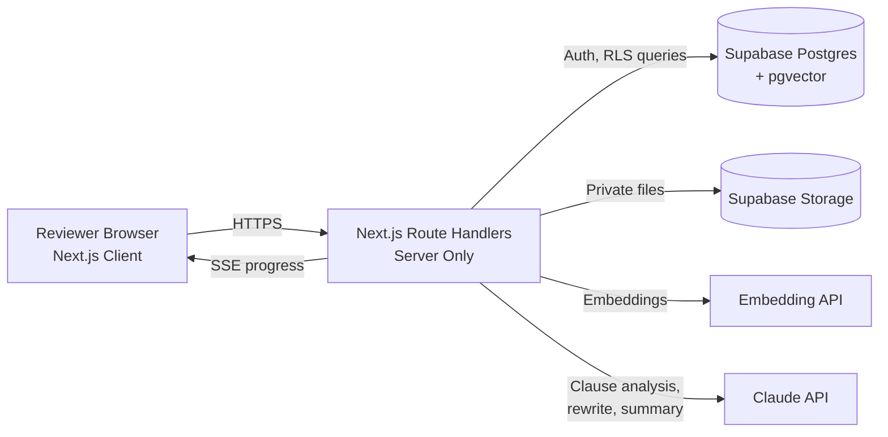

# R00t_Access
# LexiGuard

**Enterprise contract risk and redline assistant.** Upload a vendor contract and get an executive risk scorecard, clause-level policy comparison and AI-suggested safer wording in seconds.

Built for **Zephoria 2K26: Vibecoding** (Problem Statement PS-04, LegalTech and Enterprise Compliance).

- **Live demo:** `<your-vercel-url>`
- **Repository:** `<your-github-url>`
- **Demo video (optional):** `<link>`

> AI-assisted analysis. Not legal advice. Review by qualified counsel is required.

---

## Table of Contents

1. [The Problem](#the-problem)
2. [The Solution](#the-solution)
3. [Key Features](#key-features)
4. [Pages and Modules](#pages-and-modules)
5. [How It Works (Pipeline)](#how-it-works-pipeline)
6. [Tech Stack](#tech-stack)
7. [Architecture](#architecture)
8. [Risk Scoring Formula](#risk-scoring-formula)
9. [Security](#security)
10. [Database Overview](#database-overview)
11. [Project Structure](#project-structure)
12. [Getting Started](#getting-started)
13. [Environment Variables](#environment-variables)
14. [Demo Accounts and Sample Data](#demo-accounts-and-sample-data)
15. [Testing](#testing)
16. [Deployment](#deployment)
17. [AI Usage and Prompt Log](#ai-usage-and-prompt-log)
18. [Known Limitations](#known-limitations)
19. [Roadmap](#roadmap)
20. [Team](#team)

---

## The Problem

Procurement and legal teams spend **15+ hours** reviewing each third-party Master Service Agreement (MSA). Even then, they can miss non-standard indemnification liabilities, hidden penalty clauses and non-compliance with data privacy regulations.

## The Solution

LexiGuard automatically compares every clause of a vendor contract against the company's own **legal playbook**. It flags how far each clause deviates, highlights the risky language, explains why, and generates compliant replacement clauses that the reviewer can accept, reject or edit in an interactive redline workspace.

**Verification target:** upload an unvetted agreement and receive an executive risk scorecard in **under 10 seconds**, with risky liability limits flagged and replacement language displayed.

---

## Key Features

| Feature | What it does |
|---|---|
| **Clause-level vector parsing** | Splits the contract into clauses and converts each into an embedding so it can be matched to the right playbook rule by meaning, not keywords. |
| **Policy discrepancy highlighter** | Side-by-side view of "Playbook requires" vs "Vendor wrote", with risky phrases highlighted inline. |
| **Severity flagging** | Every finding is labeled Critical, High, Medium or Low, with icon, color and text. |
| **Explainable flags** | Each flag cites the exact playbook rule, the exact vendor phrases and a plain-language reason. |
| **AI replacement clauses** | Generates an ideal clause, an acceptable fallback and a walk-away position for negotiation. |
| **Interactive redline editor** | Word-level diff (red deletions, green insertions) with Accept, Reject and Edit. Every change persists to the database instantly. |
| **Live risk score** | Score updates in real time as redlines are accepted (for example 78 to 31). |
| **Missing clause detection** | Flags mandatory clauses that are absent, such as breach notification or SLA credits. |
| **Regulation tagging** | Tags clauses against DPDP Act 2023 (India), GDPR and similar requirements. |
| **Plain English mode** | Explains legalese in simple language for non-lawyers. |
| **Editable playbook** | Admins manage the company's rules. Changing a rule changes future analysis results. |
| **Executive summary export** | One-page PDF with score, top risks, change status and recommendation. DOCX export of the redlined contract. |
| **Audit trail** | Append-only log of who did what and when. |
| **Role-based access** | Admin, Reviewer and Viewer roles enforced in the UI and on the server. |

---

## Pages and Modules

| Route | Page | Purpose |
|---|---|---|
| `/` | Landing | Product overview and how it works |
| `/login`, `/signup` | Authentication | Secure sign in, persona-based demo access |
| `/dashboard` | Contract Library | List of contracts, KPIs, upload zone, search and filters |
| `/contracts/[id]/processing` | Analysis Progress | Live stepper while the pipeline runs |
| `/contracts/[id]` | Executive Risk Scorecard | Score gauge, recommendation, category breakdown, top deal-breakers |
| `/contracts/[id]/review` | Reviewer Workspace | Clause navigator, contract viewer with highlights, analysis panel |
| `/contracts/[id]/redline` | Redline Editor | Diff view with accept, reject and edit |
| `/playbook` | Legal Playbook | Manage the rules contracts are compared against |
| `/audit` | Compliance and Audit Trail | Filterable activity log with export |
| `/settings` | Settings | Profile, organization and roles |

---

## How It Works (Pipeline)

```
Upload -> Validate -> Parse -> Segment into clauses -> Embed -> Match to playbook
      -> AI analysis (parallel) -> Missing-clause check -> Score -> Persist -> Scorecard
```

1. **Upload and validate:** checks file type, magic bytes and size limit, then stores the file in a private bucket.
2. **Parse:** extracts text from PDF or DOCX, keeping page numbers.
3. **Segment:** splits into clauses using headings and numbering, with a paragraph-chunk fallback.
4. **Embed:** all clauses are embedded in one batched request.
5. **Match:** pgvector cosine similarity finds the closest playbook rule for each clause.
6. **Analyze:** the LLM receives each clause with its matched rule and returns strict JSON (severity, summary, risky quotes, suggested clause). Calls run in parallel.
7. **Verify:** every risky quote returned by the AI is checked against the real clause text. Quotes that cannot be found are discarded, so highlights are never hallucinated.
8. **Detect missing clauses:** mandatory rules with no matching clause become "missing clause" findings.
9. **Score:** a deterministic formula computes the risk score.
10. **Persist and stream:** results are saved to Postgres and progress is streamed to the UI.

---

## Tech Stack

> Verify this table against your `package.json` before submitting, and edit any line that differs from what was actually built.

### Frontend

| Technology | Purpose |
|---|---|
| **Next.js (App Router)** | React framework, routing and server rendering |
| **TypeScript (strict)** | Type safety across client and server |
| **Tailwind CSS** | Utility-first styling with design tokens |
| **shadcn/ui + Radix UI** | Accessible UI components |
| **Framer Motion** | Page transitions and micro-interactions |
| **Three.js + React Three Fiber** | 3D hero scene and animated visuals |
| **TanStack Query** | Server-state fetching and caching |
| **Zustand** | Small UI state |
| **React Hook Form + Zod** | Forms and shared validation schemas |
| **Recharts** | Charts (category breakdown, risk distribution) |
| **lucide-react** | Icons |

### Backend

| Technology | Purpose |
|---|---|
| **Next.js Route Handlers** | Server-side API (all secrets stay here) |
| **Server-Sent Events (SSE)** | Live analysis progress stream |
| **Zod** | Request and AI-response validation |
| **p-limit** | Concurrency control for parallel clause analysis |
| **Upstash Ratelimit** (or in-memory fallback) | Rate limiting on upload and AI endpoints |

### Database, Auth and Storage

| Technology | Purpose |
|---|---|
| **Supabase Postgres** | Primary database |
| **pgvector** | Vector similarity search for clause-to-rule matching |
| **Supabase Auth** | Email/password and OAuth authentication |
| **Supabase Storage** | Private contract file storage |
| **Row Level Security (RLS)** | Per-organization data isolation |

### AI

| Technology | Purpose |
|---|---|
| **Anthropic Claude API** (`@anthropic-ai/sdk`) | Clause analysis, rewriting and executive summary |
| **Voyage AI embeddings** (or configured alternative) | Vector embeddings for clauses and playbook rules |
| **Structured JSON output + Zod** | Reliable, validated model responses |

### Documents and Export

| Technology | Purpose |
|---|---|
| **pdf-parse / pdfjs-dist** | PDF text extraction |
| **mammoth** | DOCX text extraction |
| **diff-match-patch** | Word-level redline diffs |
| **@react-pdf/renderer** (or pdf-lib) | Executive summary PDF |
| **docx** | Redlined contract DOCX export |

### Tooling and Deployment

| Technology | Purpose |
|---|---|
| **Vitest** | Unit tests (scoring, segmentation, span verification) |
| **Playwright** | End-to-end smoke test |
| **ESLint + TypeScript** | Linting and type checks |
| **Vercel** | Hosting for frontend and API |
| **Supabase Cloud** | Managed database, auth and storage |

---

## Architecture



**Principle:** the browser never talks to AI providers or uses privileged keys. All secrets live in server-side environment variables.

---

## Risk Scoring Formula

The score is **deterministic**, not an AI guess. The same contract always produces the same score.

| Severity | Base points |
|---|---|
| Critical | 25 |
| High | 15 |
| Medium | 7 |
| Low | 2 |
| None / Compliant | 0 |

- Each finding's points are multiplied by `rule_weight / 5` (default weight is 5).
- A missing mandatory clause adds **+10** (critical categories add **+15**).
- Findings whose redline is **accepted** contribute 0 points.
- **Final score** = `min(100, round(total points))`.

| Score | Level |
|---|---|
| 0 - 24 | Low |
| 25 - 49 | Medium |
| 50 - 74 | High |
| 75 - 100 | Critical |

**Recommendation:** *Sign* (score below 25 and no critical findings), *Negotiate* (25 to 74, or any high finding), *Reject* (75 or above, or 2+ unresolved critical findings).

---

## Security

| Area | Measure |
|---|---|
| **Secrets** | No API keys in the client bundle or repository. Provider and service-role keys are used only in server code. `.env*` is gitignored. |
| **Authentication** | Supabase Auth with email verification, password rules and protected routes via middleware. |
| **Authorization** | Role-based access (Admin, Reviewer, Viewer) enforced in the UI and again on the server. |
| **Data isolation** | Row Level Security on every table. Users can access only their organization's rows. |
| **File safety** | MIME type and magic-byte validation, size limit, filename sanitization, private storage bucket. |
| **Input validation** | Zod validation on every route handler. Typed errors with proper HTTP status codes. |
| **Prompt injection defense** | Contract text is passed as delimited untrusted data. The model output is schema-validated, and instructions inside contracts are ignored. |
| **Hallucination control** | Risky quotes returned by the AI must exist in the source clause or they are dropped. |
| **Rate limiting** | Limits on upload and AI endpoints to control abuse and cost. |
| **Auditability** | Append-only audit log for sensitive actions (upload, analysis, accept, reject, edit, export, playbook change). |
| **Headers** | CSP, X-Frame-Options, X-Content-Type-Options, Referrer-Policy and HSTS configured. |

See `SECURITY.md` for the threat model.

---

## Database Overview

| Table | Purpose |
|---|---|
| `organizations`, `profiles` | Tenants, users and roles |
| `contracts` | Uploaded contracts, status, original and current risk score |
| `clauses` | Parsed clauses with text, position and vector embedding |
| `playbook_rules` | Company rules with ideal, fallback and walk-away text and embedding |
| `findings` | Per-clause analysis: severity, deviation summary, verified risky spans, suggestions |
| `redlines` | Original, proposed and final text with accept/reject/edit status |
| `comments` | Reviewer comments per clause |
| `score_snapshots` | Score history for before/after tracking |
| `audit_logs` | Append-only activity log |
| `ai_usage_logs` | Model, tokens and latency per AI call |

All schema changes are in `supabase/migrations`.

---

## Project Structure

```
lexiguard/
├── app/                    # Routes and API route handlers
│   ├── (auth)/             # login, signup
│   ├── dashboard/
│   ├── contracts/[id]/     # scorecard, review, redline, processing
│   ├── playbook/
│   ├── audit/
│   ├── settings/
│   └── api/                # server-side endpoints
├── components/             # ui, layout, workspace, redline, scorecard, playbook
├── lib/
│   ├── supabase/           # browser, server and admin clients
│   ├── ai/                 # prompts, schemas, model calls
│   ├── parsing/            # PDF and DOCX extraction
│   ├── segmentation/       # clause splitter
│   ├── matching/           # vector matching
│   ├── scoring.ts          # deterministic risk formula
│   ├── diff.ts             # redline diff engine
│   ├── validators/         # Zod schemas
│   ├── rate-limit.ts
│   └── audit.ts
├── hooks/
├── types/
├── supabase/
│   ├── migrations/         # schema, RLS policies, RPC functions
│   └── seed.sql
├── scripts/                # seed and utility scripts
├── samples/                # sample vendor contracts (PDF and DOCX)
├── tests/
├── README.md
├── SECURITY.md
├── AI_PROMPT_LOG.md
└── .env.example
```

---

## Getting Started

### Prerequisites

- Node.js 18 or later
- A Supabase project (with the `vector` extension enabled)
- An Anthropic API key
- An embeddings provider key (for example Voyage AI)

### Setup

```bash
# 1. Clone
git clone <your-github-url>
cd lexiguard

# 2. Install dependencies
npm install

# 3. Configure environment
cp .env.example .env.local
# Fill in the values (see the table below)

# 4. Apply database migrations
npx supabase db push        # or run the SQL files in supabase/migrations manually

# 5. Seed the default playbook and demo data
npm run seed

# 6. Start the dev server
npm run dev
```

Open `http://localhost:3000`.

### Useful Scripts

| Command | Description |
|---|---|
| `npm run dev` | Start the development server |
| `npm run build` | Production build |
| `npm run start` | Run the production build |
| `npm run lint` | Lint the code |
| `npm run typecheck` | TypeScript check |
| `npm run test` | Run unit tests |
| `npm run seed` | Seed playbook rules and demo data |

---

## Environment Variables

Copy `.env.example` to `.env.local`. **Never commit real values.**

| Variable | Scope | Description |
|---|---|---|
| `NEXT_PUBLIC_SUPABASE_URL` | Public | Supabase project URL |
| `NEXT_PUBLIC_SUPABASE_ANON_KEY` | Public | Supabase anon key (safe with RLS enabled) |
| `SUPABASE_SERVICE_ROLE_KEY` | **Server only** | Privileged key, never sent to the client |
| `ANTHROPIC_API_KEY` | **Server only** | Claude API key |
| `ANALYSIS_MODEL` | Server | Model for per-clause analysis |
| `SUMMARY_MODEL` | Server | Model for executive summary and complex rewrites |
| `EMBEDDING_PROVIDER` | Server | Embedding provider name |
| `EMBEDDING_API_KEY` | **Server only** | Embeddings provider key |
| `UPSTASH_REDIS_REST_URL` | Server | Rate limiting (optional) |
| `UPSTASH_REDIS_REST_TOKEN` | **Server only** | Rate limiting (optional) |

---

## Demo Accounts and Sample Data

Persona-based demo access is available on the login screen:

| Persona | Role | Can do |
|---|---|---|
| Sarah Chen | Admin | Everything, including playbook edits and user management |
| David | Reviewer | Analyze contracts, accept/reject/edit redlines |
| Alex | Viewer | Read-only access |

> These are for evaluation only. Disable demo access in production.

**Sample contract:** `samples/` contains a deliberately risky vendor MSA with unlimited liability, one-sided indemnity, long auto-renewal notice, high late fees, vendor-owned IP, foreign governing law, and missing breach-notification and SLA clauses.

### 3-Minute Verification Flow

1. Log in and open the dashboard.
2. Upload the sample vendor agreement.
3. Watch the live progress stepper.
4. View the risk scorecard (generated in under 10 seconds).
5. Open the workspace and inspect the flagged liability clause with recommended replacement language.
6. Accept a redline, refresh the page, and confirm the change persists and the score updated.
7. Export the executive summary.

---

## Testing

```bash
npm run test         # unit tests (scoring, clause splitter, span verifier, diff)
npm run test:e2e     # Playwright: login -> upload -> scorecard -> accept -> refresh -> persisted
```

Additional checks performed before release:

- RLS verified: a user from organization A cannot read organization B's data.
- Production bundle searched to confirm no secrets are present.
- Failure cases handled: corrupt file, scanned PDF, empty text, AI timeout or invalid JSON (retry, then mark the clause as failed without crashing the run), rate limit exceeded.

---

## Deployment

1. Push the repository to GitHub.
2. Import the project in **Vercel**.
3. Add all environment variables in the Vercel dashboard (server-only keys must not use the `NEXT_PUBLIC_` prefix).
4. Run the Supabase migrations against the production project.
5. Deploy and run the verification flow above on the live URL.

---

## AI Usage and Prompt Log

- **Development:** the application was generated with AI assistance (Antigravity) during the event. Key prompts and phases are summarized in `AI_PROMPT_LOG.md`.
- **Runtime:** Claude analyzes each clause against its matched playbook rule and returns structured JSON. Embeddings power clause-to-rule matching.
- **Controls:** temperature 0, schema-validated output, one retry on malformed JSON, verified quote offsets, and token and latency logging per call in `ai_usage_logs`.

---

## Known Limitations

- Scanned or image-only PDFs are rejected (no OCR yet).
- Clause segmentation relies on headings and numbering. Unusually formatted contracts fall back to paragraph chunking and may be less precise.
- Analysis quality depends on the quality and coverage of the playbook rules.
- AI output is advisory and must be reviewed by qualified counsel.
- `<add any other limitation specific to your build>`

---

## Roadmap

- OCR support for scanned contracts
- Side-by-side comparison of two vendors' contracts
- Email and Slack notifications when analysis completes
- Multi-language contract support
- Playbook templates for different industries
- SSO (SAML) for enterprise sign-in

---

## Team

| Name | Role |
|---|---|
| `<Your Name>` | `<Role>` |
| `<Teammate>` | `<Role>` |

---

## Disclaimer

LexiGuard provides AI-assisted analysis for informational purposes only. It does not constitute legal advice. All outputs must be reviewed by qualified legal counsel before any contract decision.
