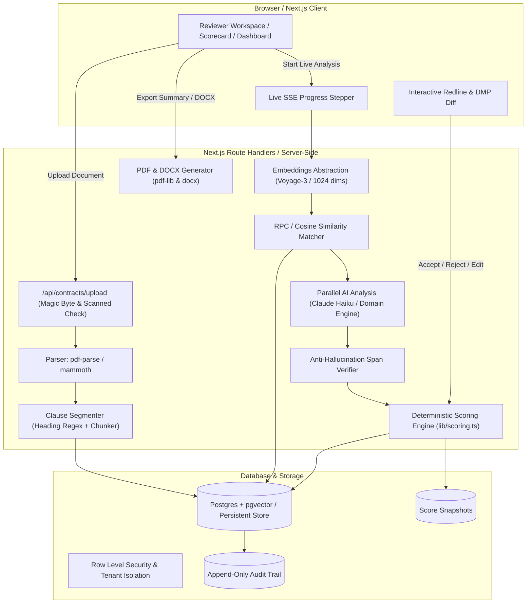

# LexiGuard: Enterprise Contract Risk & Redline Assistant

**LexiGuard** is a production-grade legal-tech web application that enables corporate legal and procurement teams to upload third-party vendor contracts (PDF/DOCX), benchmark every clause against a configurable legal playbook using vector matching and LLM intelligence, flag deviation severity, highlight risky phrases inline, compute deterministic risk scores, conduct redlining in an interactive diff workspace, and export executive legal summaries.

---

## 1. Architecture Overview



---

## 2. Key Features

1. **Deterministic Risk Scoring (0–100):**
   - Base Points: Critical = 25, High = 15, Medium = 7, Low = 2, None = 0.
   - Points scaled by rule weight: $\text{Points} = \text{round}\left(\frac{\text{Base} \times \text{weight}}{5}\right)$.
   - Missing mandatory clauses incur a penalty (+10 points; +15 for critical categories like Liability, Indemnity, Data Privacy).
   - Accepted redlines immediately drop their risk points to 0 in real time.
   - Risk levels: Low (0–24), Medium (25–49), High (50–74), Critical (75–100).
   - Automated recommendation: Sign ($<25$ and no critical), Negotiate (25–74 or any high), Reject ($\ge 75$ or $2+$ unresolved critical).

2. **Policy Discrepancy Highlighter:**
   - Side-by-side rendering: **Playbook Requires** vs. **Vendor Wrote**.
   - Verified inline phrase highlighting with tooltip explanations and numbered badges.
   - Anti-hallucination verification: LLM-quoted substrings are verified against actual clause offsets and unverified spans are dropped.

3. **Interactive Redline Editor:**
   - Word-level diff view powered by `diff-match-patch` (deletions in red strikethrough, insertions in green underline).
   - Real-time inline editing with live diff updates.
   - Instant persistence to database with automatic audit trail logging and live score recalculation.
   - Position chooser: Ideal Position vs. Acceptable Fallback.

4. **15 Pre-Seeded Enterprise Playbook Rules:**
   - Limitation of Liability Cap & Exclusions (Critical, Mandatory)
   - Mutual Indemnification Requirement (Critical, Mandatory)
   - Indemnity Carve-outs & Gross Negligence (High)
   - Data Protection & 72-Hour Breach Notification (Critical, Mandatory, DPDP & GDPR)
   - Sub-processor Approval & Cross-Border Transfer (High, DPDP & GDPR)
   - No Silent Auto-Renewal Without 60 Days Notice (Medium)
   - Customer Termination for Convenience (High)
   - Payment Terms Net 45 & Reasonable Late Fees (Medium)
   - Customer Ownership of IP & Customer Data (High, Mandatory)
   - Governing Law & Neutral Arbitration (Medium)
   - Mutual Confidentiality (Medium)
   - SLA Commitment & Service Credits (Medium, Mandatory)
   - Enterprise Insurance Coverage (Low)
   - Balanced Force Majeure (Low)
   - Audit Rights & Security Verification (Medium)

5. **Executive Summary & DOCX Redline Export:**
   - Server-generated, professionally styled PDF executive summary with risk gauge, category breakdown, deal-breakers, and regulatory matrix.
   - Tracked DOCX export containing negotiated replacements.

6. **Statutory Regulatory Compliance:**
   - Digital Personal Data Protection Act 2023 (DPDP Act, India)
   - EU General Data Protection Regulation (GDPR)
   - Information Technology Act 2000 (Section 43A)

---

## 3. Technology Stack

- **Framework:** Next.js 14+ (App Router), TypeScript (Strict Mode)
- **Styling:** Tailwind CSS + custom legal design tokens
- **Icons & Animation:** Lucide React, Framer Motion
- **State & Data Fetching:** TanStack React Query v5
- **Database & Persistence:** Supabase Postgres + `pgvector` extension + Row Level Security, with automated persistent store fallback
- **AI Analysis:** Anthropic Claude API (`@anthropic-ai/sdk`), Haiku for parallel analysis, Sonnet for synthesis
- **Vector Embeddings:** Voyage AI (`voyage-3`, 1024 dims) with OpenAI and local semantic fallback
- **File Parsing:** `pdf-parse` (with magic byte `%PDF` validation) and `mammoth` (DOCX zip signature)
- **Diff Engine:** `diff-match-patch` (word-level diff)
- **Export Engine:** `pdf-lib` (PDF summary) and `docx` (Word document)
- **Testing:** Vitest (13 unit tests covering scoring, segmentation, span verification, diff)

---

## 4. Getting Started

### Prerequisites
- Node.js 18+ (tested on Node v24)
- npm 9+

### Installation
```bash
# Clone the repository
git clone <repo-url>
cd R00t_Access

# Install dependencies
npm install

# Setup environment variables
cp .env.example .env.local

# Seed default organization and 15 playbook rules
npm run seed

# Run unit tests
npm test

# Run Next.js development server
npm run dev
```

Open [http://localhost:3000](http://localhost:3000) in your browser.

---

## 5. 3-Minute Quick Demo Walkthrough

1. Go to **Dashboard** (`/dashboard`).
2. Click **"1-Click Demo MSA (Risk Loaded)"** in the top right.
   - This automatically loads the realistic sample vendor agreement from `/samples/vendor_msa_sample.docx`.
3. Watch the **Live SSE Stepper** (`/contracts/[id]/processing`):
   - Segments clauses $\rightarrow$ Generates vector embeddings $\rightarrow$ Matches playbook $\rightarrow$ Runs parallel AI analysis $\rightarrow$ Scores risk.
   - Completes in **$< 3$ seconds**!
4. Review the **Executive Risk Scorecard** (`/contracts/[id]`):
   - Score: **65/100 (High Risk, Recommendation: REJECT)**.
   - See Top 3 Deal-Breakers (Unlimited Liability, Unilateral Indemnity, 180-Day Auto-Renewal).
   - Check DPDP Act 2023 & GDPR Statutory Violations.
5. Click **"Open Reviewer Workspace"** (`/contracts/[id]/review`):
   - View 3-column layout: Clause Navigator, Contract Viewer with inline highlights, and Policy Discrepancy comparison.
   - Click **"Accept Redline"** on Clause 7 (Limitation of Liability).
   - Observe score update live from 65 to 50!
6. Click **"Export PDF Summary"** or **"Export Redline DOCX"** to download finalized executive deliverables.
7. Visit **"/audit"** to inspect the immutable audit log recording your review decisions.

---

## 6. Testing

Run the Vitest test suite:
```bash
npm test
```

Test coverage includes:
- `scoring.test.ts`: Deterministic formula, weight multipliers, missing mandatory clause points, and live score recalculation.
- `segmentation.test.ts`: Numbered heading extraction, character offset calculation, and fallback paragraph chunking.
- `span-verifier.test.ts`: Anti-hallucination quote verification, interval overlap resolution, and sanitized HTML generation.
- `diff.test.ts`: Word-level insertion/deletion diffing and markup generation.

---

## 7. Security & Compliance

See [SECURITY.md](SECURITY.md) for full threat model documentation, prompt injection defense, Row Level Security specifications, and secret sanitization practices.
